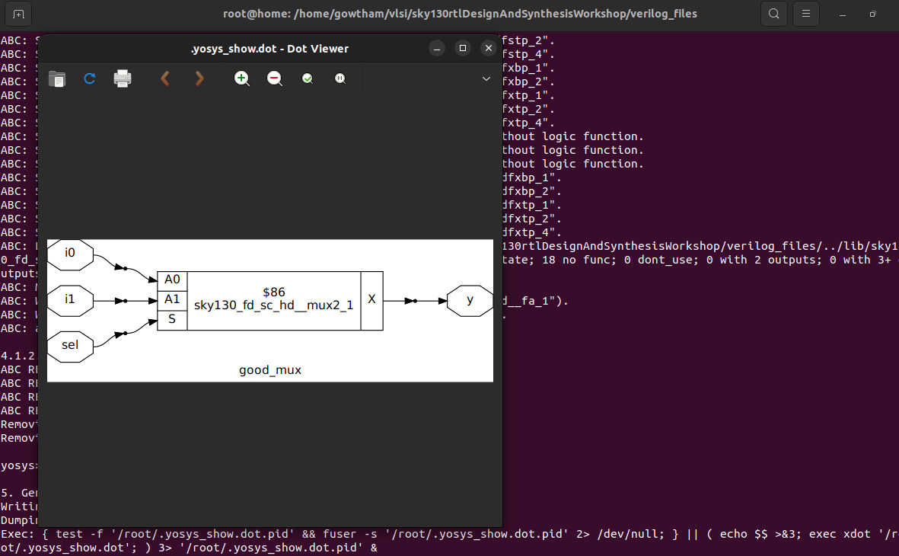

<div align="center">

# 🌟🚀 **Day 1: Introduction to Verilog RTL Design & Synthesis** 🛠️💡


</div>


> 🎉 Welcome to **Day 1** of the RTL Workshop!  
> Today, you’ll kickstart your journey into **digital design**, learning:  
> - **Verilog RTL** coding  
> - **Open-source simulation** with Icarus Verilog (`iverilog`)  
> - **Logic synthesis** using Yosys  

> 💡 This guide includes **practical labs, essential concepts, and step-by-step explanations** to help you build a strong foundation in RTL design.

---
| Section | Topics | Link |
|---------|--------|------|
| 1️⃣  **Simulator & Testbench Essentials** | - Simulator Overview <br> - Design Explanation <br> - Testbench Setup | 🔗 [Simulator & Testbench](https://github.com/Gowtham007007/Week-1_RISC-V_Tapeout/tree/main/Day_1#1%EF%B8%8F%E2%83%A3--simulator--testbench-essentials) |
| 2️⃣  **Getting Started with Icarus Verilog** 💻| - Simulation Flow <br> - Generating Waveform Files (.vcd) | 🔗 [Icarus Verilog Setup](https://github.com/Gowtham007007/Week-1_RISC-V_Tapeout/tree/main/Day_1#2%EF%B8%8F%E2%83%A3--getting-started-with-icarus-verilog-) |
| 3️⃣  **Lab: 2-to-1 Multiplexer Simulation** 🧪|- Clone Repository <br> - Install Tools <br> - Compile & Run <br> - Waveform Visualization | 🔗 [Mux Simulation Lab](https://github.com/Gowtham007007/Week-1_RISC-V_Tapeout/tree/main/Day_1#3%EF%B8%8F%E2%83%A3--lab-2-to-1-multiplexer-simulation-) |
| 4️⃣  **Multiplexer Verilog Code Analysis** 🔍|- Module Code <br> - Logic Explanation | 🔗 [Code Analysis](https://github.com/Gowtham007007/Week-1_RISC-V_Tapeout/tree/main/Day_1#4%EF%B8%8F%E2%83%A3--multiplexer-verilog-code-analysis-) |
| 5️⃣  **Introduction to Yosys & Gate Libraries** ⚡|- What is Yosys? <br> - Features of Yosys <br> - Understanding Gate Library Flavors | 🔗 [Yosys & Libraries](https://github.com/Gowtham007007/Week-1_RISC-V_Tapeout/tree/main/Day_1#5%EF%B8%8F%E2%83%A3--introduction-to-yosys--gate-libraries-) |
| 6️⃣  **Synthesis Lab with Yosys** 🏗️ |- Step-by-Step Synthesis Flow <br> - Visualizing Gate-Level Netlist <br> - Exporting Netlist | 🔗 [Yosys Synthesis Lab](https://github.com/Gowtham007007/Week-1_RISC-V_Tapeout/tree/main/Day_1#6%EF%B8%8F%E2%83%A3--synthesis-lab-with-yosys-%EF%B8%8F) |
| 7️⃣  **Workshop Summary & Key Takeaways** 📝 |Quick Recap | 🔗 [Summary](https://github.com/Gowtham007007/Week-1_RISC-V_Tapeout/tree/main/Day_1#7%EF%B8%8F%E2%83%A3--workshop-summary--key-takeaways-) |


---

<div align="center">


</div>

> 🚀 Get ready to **write, simulate, and synthesize** your first Verilog circuits!  
> By the end of Day 1, you'll be confident in **running simulations**, analyzing waveforms, and generating basic gate-level netlists.


# 1️⃣  **Simulator & Testbench Essentials**

###  Simulator

A **simulator** is a software tool that checks your digital circuit’s functionality by applying test inputs and viewing outputs. This helps you verify your design before hardware implementation.

###  Design

The **design** is your Verilog code describing the intended logic functionality.

###  Testbench

A **testbench** is a simulation environment that applies various inputs to your design and checks if the outputs are correct.

<div align="center">
  
</div>

---

# 2️⃣  **Getting Started with Icarus Verilog** 💻

**iverilog** is an open-source simulator for Verilog. Here’s the typical simulation flow:

<div align="center">
  
</div>

- Both the design and testbench are provided as input to iverilog.
- The simulator produces a `.vcd` file for waveform viewing in GTKWave.

---

# 3️⃣  **Lab: 2-to-1 Multiplexer Simulation** 🧪

Let’s simulate a simple **2-to-1 multiplexer** using iverilog!

###  Step 1: Clone the Workshop Repository

```shell
git clone https://github.com/kunalg123/sky130RTLDesignAndSynthesisWorkshop.git
cd sky130RTLDesignAndSynthesisWorkshop/verilog_files
```

###  Step 2: Install Required Tools

```shell
sudo apt install iverilog
sudo apt install gtkwave
```

###  Step 3: Simulate the Design

Compile the design and testbench:

```shell
iverilog good_mux.v tb_good_mux.v
```

Run the simulation:

```shell
./a.out
```

View the waveform:

```shell
gtkwave tb_good_mux.vcd
```

<div align="center">
  
</div>

---

# 4️⃣  **Multiplexer Verilog Code Analysis** 🔍

**The code for the multiplexer (`good_mux.v`):**

```verilog
module good_mux (input i0, input i1, input sel, output reg y);
always @ (*)
begin
    if(sel)
        y <= i1;
    else 
        y <= i0;
end
endmodule
```

###  **How It Works**

- **Inputs:** `i0`, `i1` (data), `sel` (select line)
- **Output:** `y` (registered output)
- **Logic:** If `sel` is 1, `y` gets `i1`; if `sel` is 0, `y` gets `i0`.

---

# 5️⃣  **Introduction to Yosys & Gate Libraries** ⚡

###  What is Yosys?

**Yosys** is a powerful open-source synthesis tool for digital hardware. It takes your Verilog code and converts it into a gate-level netlist—a hardware blueprint.

#### Yosys Features

- **Synthesis:** Converts HDL to a logic circuit
- **Optimization:** Improves speed or area
- **Technology Mapping:** Matches logic to actual hardware cells
- **Verification:** Checks correctness
- **Extensibility:** Supports custom flows

###  Why Do Libraries Have Different Gate "Flavors"?

A `.lib` file contains many versions of each gate (like AND, OR, NOT) with different properties:

- **Performance:** Faster gates for critical paths, slower for power savings
- **Power:** Some gates use less energy
- **Area:** Smaller gates for compact chips
- **Drive Strength:** Stronger gates to drive more load
- **Signal Integrity:** Specialized gates for noise/performance
- **Mapping:** Synthesis tools pick the best flavor for your needs

---

# 6️⃣  **Synthesis Lab with Yosys** 🏗️ 

Let’s synthesize the `good_mux` design using Yosys!

###  Step-by-Step Yosys Flow

1. **Start Yosys**
    ```shell
    yosys
    ```

2. **Read the liberty library**
    ```shell
    read_liberty -lib ../lib/sky130_fd_sc_hd__tt_025C_1v80.lib
    ```

3. **Read the Verilog code**
    ```shell
    read_verilog good_mux.v
    ```

4. **Synthesize the design**
    ```shell
    synth -top good_mux
    ```

5. **Technology mapping**
    ```shell
    abc -liberty ../lib/sky130_fd_sc_hd__tt_025C_1v80.lib
    ```

6. **Visualize the gate-level netlist**
    ```shell
    show
    ```

<div align="center">
  
</div>


7. **Viewing the Netlist generated**
```shell
write_verilog -noattr good_mux_netlist.v
```
<div align="center">
  
</div>

---

# 7️⃣  **Workshop Summary & Key Takeaways** 📝

- You learned about simulators, designs, and testbenches.
- You ran your first Verilog simulation with iverilog and visualized waveforms.
- You analyzed the 2-to-1 mux code.
- You explored Yosys and learned why gate libraries have various flavors.


---
