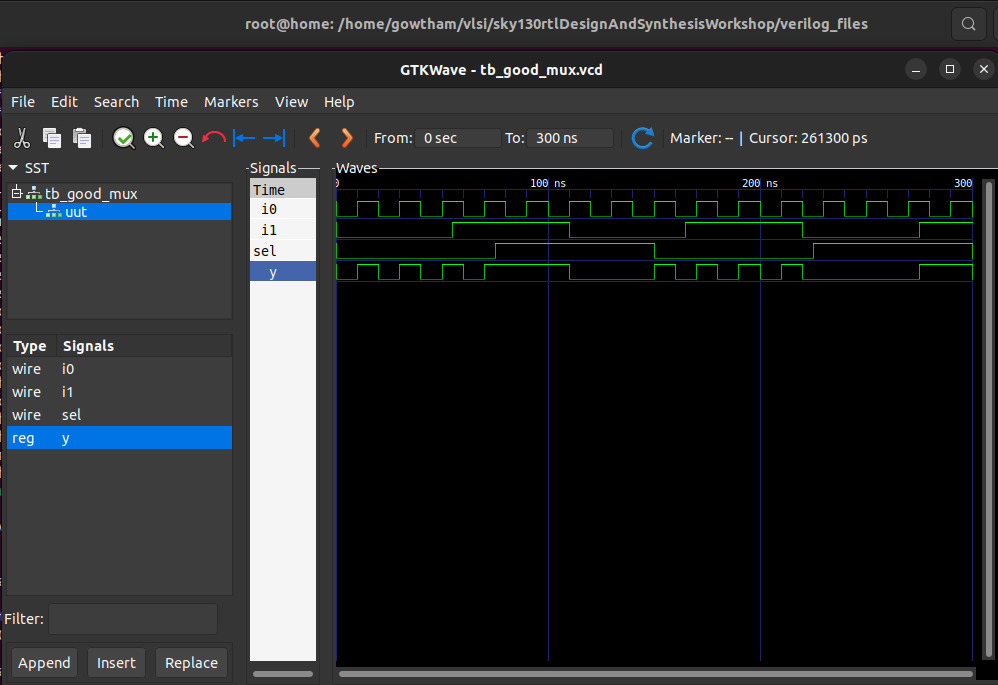

<div align="center">


</div>

# 🌟🚀 **Day 1: Introduction to Verilog RTL Design & Synthesis** 🛠️💡


> 🎉 Welcome to **Day 1** of the RTL Workshop!  
> Today, you’ll kickstart your journey into **digital design**, learning:  
> - **Verilog RTL** coding  
> - **Open-source simulation** with Icarus Verilog (`iverilog`)  
> - **Logic synthesis** using Yosys  

> 💡 This guide includes **practical labs, essential concepts, and step-by-step explanations** to help you build a strong foundation in RTL design.

---

## 🗂 Table of Contents

| Section | Topic |
|---------|-------|
| 1️⃣ | [What is a Simulator, Design, and Testbench?](#1-what-is-a-simulator-design-and-testbench) |
| 2️⃣ | [Getting Started with iverilog](#2-getting-started-with-iverilog) |
| 3️⃣ | [Lab: Simulating a 2-to-1 Multiplexer](#3-lab-simulating-a-2-to-1-multiplexer) |
| 4️⃣ | [Verilog Code Analysis](#4-verilog-code-analysis) |
| 5️⃣ | [Introduction to Yosys & Gate Libraries](#5-introduction-to-yosys--gate-libraries) |
| 6️⃣ | [Synthesis Lab with Yosys](#6-synthesis-lab-with-yosys) |
| 7️⃣ | [Summary](#7-summary) |

---

<div align="center">


</div>

> 🚀 Get ready to **write, simulate, and synthesize** your first Verilog circuits!  
> By the end of Day 1, you'll be confident in **running simulations**, analyzing waveforms, and generating basic gate-level netlists.


## 1. What is a Simulator, Design, and Testbench?

###  Simulator

A **simulator** is a software tool that checks your digital circuit’s functionality by applying test inputs and viewing outputs. This helps you verify your design before hardware implementation.

###  Design

The **design** is your Verilog code describing the intended logic functionality.

###  Testbench

A **testbench** is a simulation environment that applies various inputs to your design and checks if the outputs are correct.

<div align="center">
  
</div>

---

## 2. Getting Started with iverilog

**iverilog** is an open-source simulator for Verilog. Here’s the typical simulation flow:

<div align="center">
  
</div>

- Both the design and testbench are provided as input to iverilog.
- The simulator produces a `.vcd` file for waveform viewing in GTKWave.

---

## 3. Lab: Simulating a 2-to-1 Multiplexer

Let’s simulate a simple **2-to-1 multiplexer** using iverilog!

###  Step 1: Clone the Workshop Repository

```shell
git clone https://github.com/kunalg123/sky130RTLDesignAndSynthesisWorkshop.git
cd sky130RTLDesignAndSynthesisWorkshop/verilog_files
```

###  Step 2: Install Required Tools

```shell
sudo apt install iverilog
sudo apt install gtkwave
```

###  Step 3: Simulate the Design

Compile the design and testbench:

```shell
iverilog good_mux.v tb_good_mux.v
```

Run the simulation:

```shell
./a.out
```

View the waveform:

```shell
gtkwave tb_good_mux.vcd
```

<div align="center">
  
</div>

---

## 4. Verilog Code Analysis

**The code for the multiplexer (`good_mux.v`):**

```verilog
module good_mux (input i0, input i1, input sel, output reg y);
always @ (*)
begin
    if(sel)
        y <= i1;
    else 
        y <= i0;
end
endmodule
```

###  **How It Works**

- **Inputs:** `i0`, `i1` (data), `sel` (select line)
- **Output:** `y` (registered output)
- **Logic:** If `sel` is 1, `y` gets `i1`; if `sel` is 0, `y` gets `i0`.

---

## 5. Introduction to Yosys & Gate Libraries

###  What is Yosys?

**Yosys** is a powerful open-source synthesis tool for digital hardware. It takes your Verilog code and converts it into a gate-level netlist—a hardware blueprint.

#### Yosys Features

- **Synthesis:** Converts HDL to a logic circuit
- **Optimization:** Improves speed or area
- **Technology Mapping:** Matches logic to actual hardware cells
- **Verification:** Checks correctness
- **Extensibility:** Supports custom flows

###  Why Do Libraries Have Different Gate "Flavors"?

A `.lib` file contains many versions of each gate (like AND, OR, NOT) with different properties:

- **Performance:** Faster gates for critical paths, slower for power savings
- **Power:** Some gates use less energy
- **Area:** Smaller gates for compact chips
- **Drive Strength:** Stronger gates to drive more load
- **Signal Integrity:** Specialized gates for noise/performance
- **Mapping:** Synthesis tools pick the best flavor for your needs

---

## 6. Synthesis Lab with Yosys

Let’s synthesize the `good_mux` design using Yosys!

###  Step-by-Step Yosys Flow

1. **Start Yosys**
    ```shell
    yosys
    ```

2. **Read the liberty library**
    ```shell
    read_liberty -lib ../lib/sky130_fd_sc_hd__tt_025C_1v80.lib
    ```

3. **Read the Verilog code**
    ```shell
    read_verilog good_mux.v
    ```

4. **Synthesize the design**
    ```shell
    synth -top good_mux
    ```

5. **Technology mapping**
    ```shell
    abc -liberty ../lib/sky130_fd_sc_hd__tt_025C_1v80.lib
    ```

6. **Visualize the gate-level netlist**
    ```shell
    show
    ```

<div align="center">
  
</div>


7. **Viewing the Netlist generated**
```shell
write_verilog -noattr good_mux_netlist.v
```
<div align="center">
  
</div>

---

## 7. Summary

- You learned about simulators, designs, and testbenches.
- You ran your first Verilog simulation with iverilog and visualized waveforms.
- You analyzed the 2-to-1 mux code.
- You explored Yosys and learned why gate libraries have various flavors.


---
