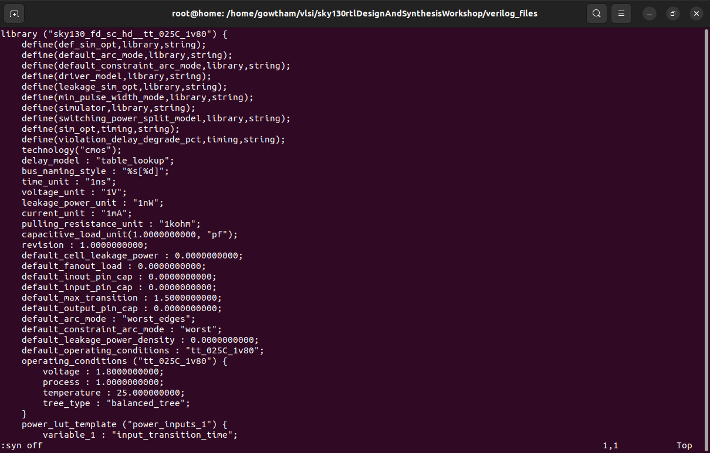
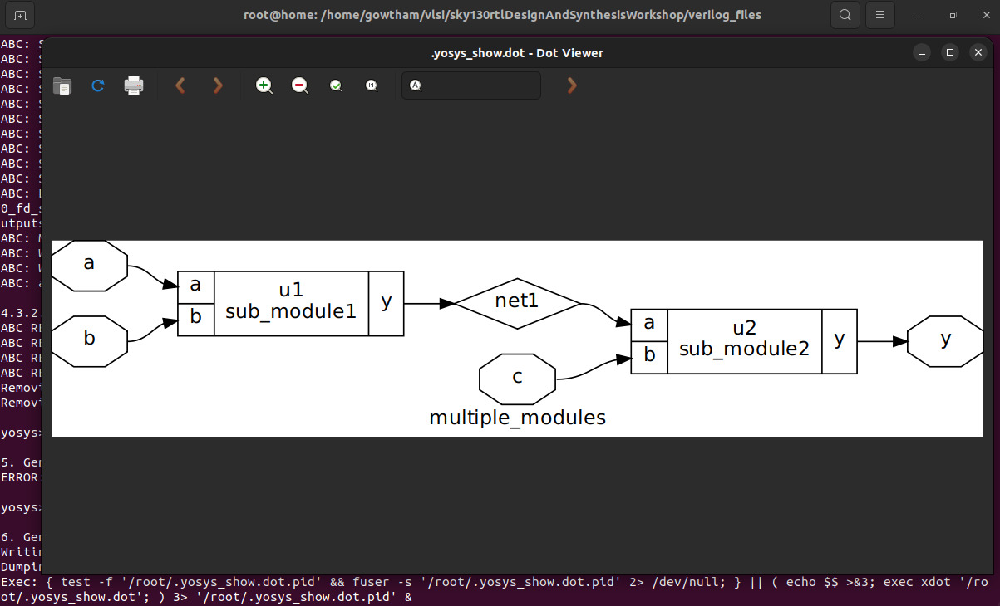
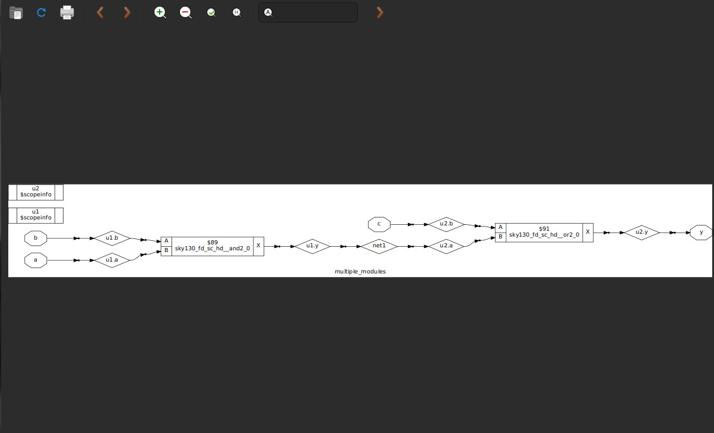
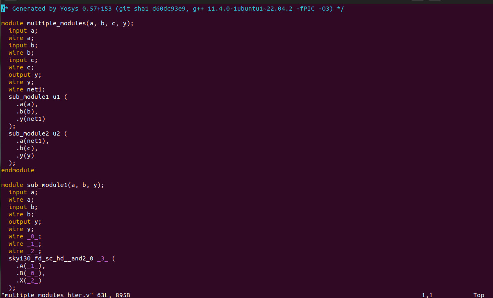
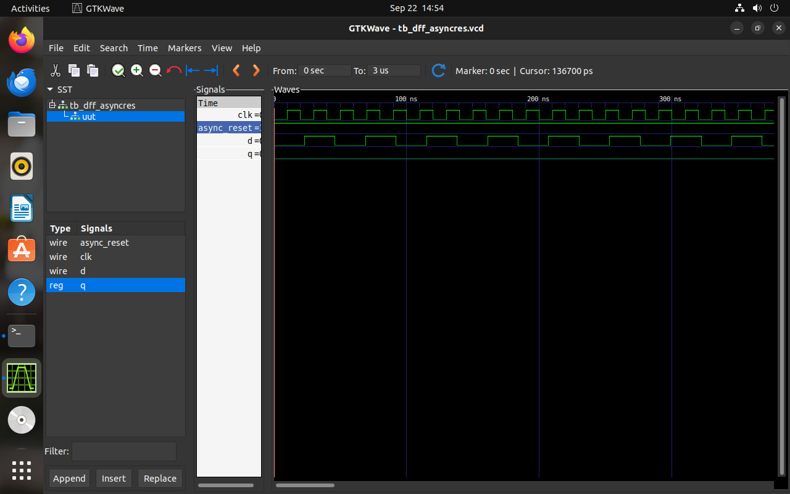
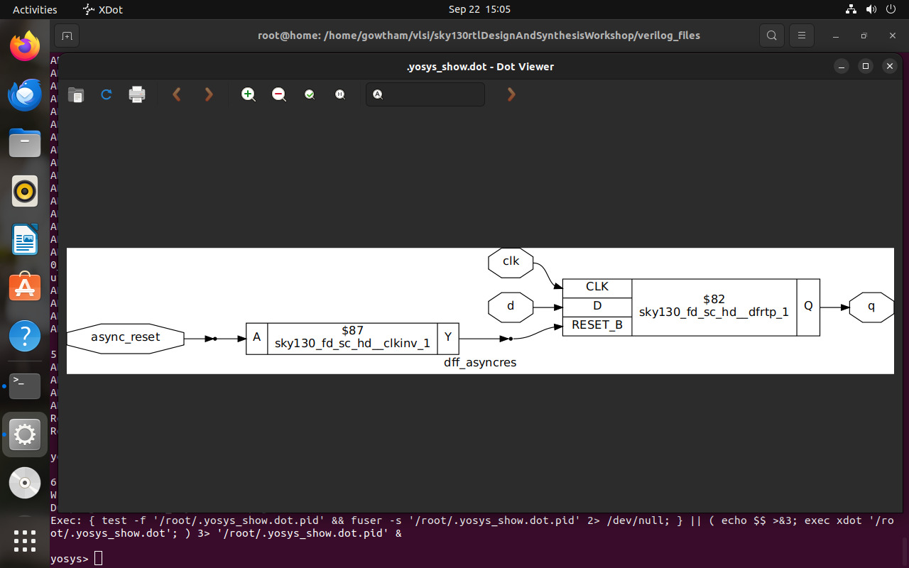
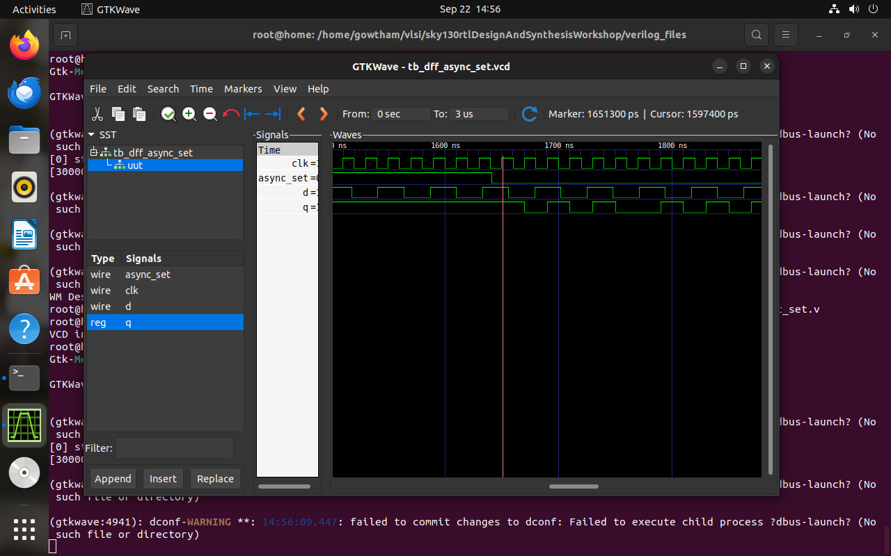
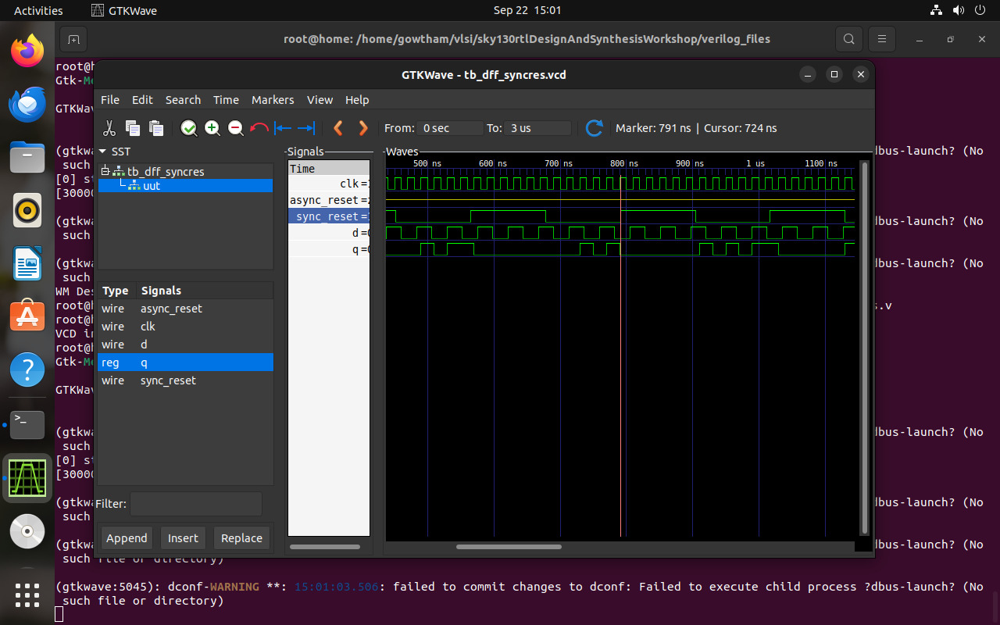
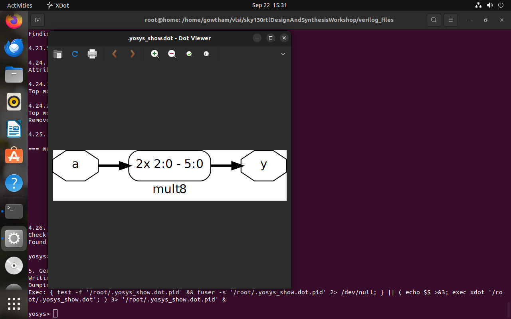

<div align="center">

# **🌟 Day 2: Advanced RTL Design & Synthesis Techniques** 🚀💻


</div>

## 🕒 Topic: Timing Libraries, Synthesis Approaches & Flip-Flop Coding  


**📖 Overview:**

Focus on advanced RTL design concepts, emphasizing **timing-aware coding ⏱️**, **synthesis strategies ⚡**, and **efficient flip-flop implementation 🛠️**. Bridges conceptual understanding with practical hardware realization.

**🎯 Objectives:**

- 📚 Understand the role of **`.lib` timing libraries** in guiding synthesis tools.
- 🔀 Compare **Hierarchical vs Flat Synthesis** and their implications on design.
- ✨ Apply **efficient RTL coding styles** for flip-flops to optimize timing and area.
- 🖥️ Simulate and synthesize designs using **Icarus Verilog** and **Yosys**, and analyze results.

**🛠️ Project Perspective:**

- ⏳ Incorporation of **timing constraints** into RTL design.
- 🏗️ Selection of appropriate **synthesis methodologies** based on design requirements.
- 💡 Writing RTL modules that are **synthesis-friendly** and **timing-accurate**.
- 📊 Analysis of simulation outputs and synthesis reports to guide iterative improvements.

---

## 📂 Contents

| **Section** 🔹 | **Topics** 📌 | **Link** 🔗 |
|----------------|---------------|-------------|
| ⏱ **Timing Libraries** | 📘 SKY130 PDK Overview<br>🔍 Decoding `tt_025C_1v80` in the SKY130 PDK<br>📝 Opening and Exploring the .lib File | [Timing Libraries](https://github.com/Gowtham007007/Week-1_RISC-V_Tapeout/tree/main/Day_2#%EF%B8%8F-timing-libraries) |
| ⚡ **Synthesis Approaches** | 🏗 Hierarchical Synthesis<br>🧩 Flattened Synthesis<br>⚖️ Key Differences Between Hierarchical & Flattened<br>💻 Multiple Module Netlist | [Synthesis Approaches](https://github.com/Gowtham007007/Week-1_RISC-V_Tapeout/tree/main/Day_2#%EF%B8%8F-hierarchical-vs-flattened-synthesis) |
| 🔹 **Flip-Flop Coding Styles** | ⏱ Asynchronous Reset D Flip-Flop<br>🔴 Asynchronous Set D Flip-Flop<br>⏹ Synchronous Reset D Flip-Flop | [Flip-Flop Coding](https://github.com/Gowtham007007/Week-1_RISC-V_Tapeout/tree/main/Day_2#-flip-flop-coding-styles) |
| 🖥 **Simulation Workflow** | 💻 Icarus Verilog Simulation<br>🌈 Viewing Waveforms in GTKWave | [Simulation Workflow](https://github.com/Gowtham007007/Week-1_RISC-V_Tapeout/tree/main/Day_2#-simulation-and-synthesis-workflow) |
| ⚡ **Synthesis Workflow** | 🛠 Synthesis with Yosys<br>🧮 Mapping Flip-Flops & Technology Mapping<br>🔹 Gate-Level Netlist Visualization | [Synthesis Workflow](https://github.com/Gowtham007007/Week-1_RISC-V_Tapeout/tree/main/Day_2#-synthesis-with-yosys) |
| 🧮 **Example Design** | i) Asynchronous Set D Flip-Flop<br> ii) Synchronous Reset D Flip-Flop | [Example Design](https://github.com/Gowtham007007/Week-1_RISC-V_Tapeout/tree/main/Day_2#-similar-examples) |
|✖️ **Multiple by 8 and its Netlist Generation**  | 📝 Viewing the Generated Netlist | [Mult by 8](https://github.com/Gowtham007007/Week-1_RISC-V_Tapeout/tree/main/Day_2#%EF%B8%8F-multiple-by-8-and-its-netlist-generation) |
| 📊 **Summary & Best Practices** | 📝 Key Takeaways<br>💡 RTL Coding Tips & Timing-Aware Practices | [Summary](https://github.com/Gowtham007007/Week-1_RISC-V_Tapeout/tree/main/Day_2#-summary) |


---


## ⏱️ Timing Libraries

### 🌌 SKY130 PDK Overview

The **SKY130 PDK** is an open-source Process Design Kit based on **SkyWater 130nm CMOS technology**, providing essential models for IC design, including **timing**, **power**, and **process variation data**. ⚡

---

### 🔍 Decoding `tt_025C_1v80` in the SKY130 PDK

| Field | Meaning |
| --- | --- |
| **tt** | Typical process corner |
| **025C** | Temperature = 25°C |
| **1v80** | Core voltage = 1.8V |

> 💡 Tip: Helps identify process, voltage, and temperature conditions modeled in the library.
> 

---

### 📝 Opening and Exploring the .lib File

To open the `sky130_fd_sc_hd__tt_025C_1v80.lib` file:

1. **Install a text editor:**
    
    ```bash
    sudo apt install gedit
    ```
    
2. Open the file :

```bash

gedit sky130_fd_sc_hd__tt_025C_1v80.lib
```



## **🏗️ Hierarchical vs. Flattened Synthesis**

🌟 Hierarchical Synthesis

Definition: Retains module hierarchy as defined in RTL, synthesizing modules separately.

How it Works: Tools like Yosys process each module independently, using commands like hierarchy.

### ✅ Advantages:

Faster synthesis time for large designs.

Easier debugging and analysis due to maintained module boundaries.

Modular approach aids integration with other tools.

### ❌ Disadvantages:

Cross-module optimizations are limited.

Reports may require extra configuration.

### Example:



## ⚡ Flattened Synthesis

Definition: Merges all modules into a single flat netlist, removing hierarchy.

How it Works: The flatten command in Yosys collapses hierarchy for whole-design optimizations.

### ✅ Advantages:

Enables aggressive cross-module optimizations.

Unified netlist may simplify downstream processes.

### ❌ Disadvantages:

Longer runtime for large designs.

Loss of hierarchy complicates debugging.

Can increase memory usage and netlist complexity.

### Example:



⚠️ Important: Hierarchical synthesis preserves sub-modules; flattening produces a netlist from the ground up.

## 📂 Multiple_Module_Netlist

### Open the Generated Netlist:

```bash

write_verilog -noattr multiple_modules_hier.v
```



### 🔑 Key Differences

| Aspect | Hierarchical Synthesis | Flattened Synthesis |
| --- | --- | --- |
| Hierarchy | Preserved | Collapsed |
| Optimization Scope | Module-level only | Whole-design |
| Runtime | Faster for large designs | Slower for large designs |
| Debugging | Easier (traces to RTL) | Harder |
| Output Complexity | Modular structure | Single, complex netlist |
| Use Case | Modularity, analysis, reporting | Maximum optimization |

## 🔹 Flip-Flop Coding Styles

Flip-flops are fundamental sequential elements used to store binary data. Below are efficient coding styles for different reset/set behaviors.

### ⏹ Asynchronous Reset D Flip-Flop

```verilog
module dff_asyncres (input clk, input async_reset, input d, output reg q);
always @ (posedge clk, posedge async_reset)
if (async_reset)
q <= 1'b0;
else
q <= d;
endmodule
```

**Asynchronous reset:**  Overrides clock, setting q to 0 immediately.

Edge-triggered: Captures d on rising clock edge if reset is low. 

## 🔴 Asynchronous Set D Flip-Flop

```verilog

module dff_async_set (input clk, input async_set, input d, output reg q);
always @ (posedge clk, posedge async_set)
if (async_set)
q <= 1'b1;
else
q <= d;
endmodule
```

Asynchronous set: Overrides clock, setting q to 1 immediately.

### ⏱️ Synchronous Reset D Flip-Flop

```verilog

module dff_syncres (input clk, input async_reset, input sync_reset, input d, output reg q);
always @ (posedge clk)
if (sync_reset)
q <= 1'b0;
else
q <= d;
endmodule

```

Synchronous reset: Takes effect only on the clock edge.

## 🖥 Simulation and Synthesis Workflow

### 💻 Icarus Verilog Simulation

### Compile:

```bash
iverilog dff_asyncres.v tb_dff_asyncres.v
```

### Run:

```bash
./a.out
```

### View Waveform:

```bash

gtkwave tb_dff_asyncres.vcd
```



## ⚡ Synthesis with Yosys

### Start Yosys:

```bash
yosys
```

### Read Liberty library:

```bash

read_liberty -lib /address/to/your/sky130/file/sky130_fd_sc_hd__tt_025C_1v80.lib
```

### Read Verilog code:

```bash

read_verilog /path/to/dff_asyncres.v
```

### Synthesize:

```bash

synth -top dff_asyncres
```

### Map flip-flops:

```bash

dfflibmap -liberty /address/to/your/sky130/file/sky130_fd_sc_hd__tt_025C_1v80.lib
```

### Technology mapping:

```bash

abc -liberty /address/to/your/sky130/file/sky130_fd_sc_hd__tt_025C_1v80.lib
```

### Visualize gate-level netlist:

```bash

show
```



## 🔹 Similar Examples

### i) Asynchronous Set D Flip-Flop:



### ii) Synchronous Reset D Flip-Flop:



## ✖️ Multiple by 8 and its Netlist Generation

### 📝 Viewing the Generated Netlist

Once the design (e.g., 8-bit multiplier) is synthesized using Yosys, export the netlist:

```bash

write_verilog -noattr mul_by_8_netlist.v
```

```verilog

module mul_by_8 (input [7:0] a, input [7:0] b, output [15:0] y);
wire *0*, *1*, *2*, *3*, *4*, *5*;
// Example internal connections (auto-generated)
assign *0* = a[0] & b[0];
assign *1* = a[1] & b[0];
assign *2* = a[0] & b[1];
assign *3* = *1* ^ *2*;
assign y[0] = *0*;
assign y[1] = *3*;
// ...
endmodule
```



## 🏁 Summary

This overview provides practical insights into timing libraries, synthesis strategies, and reliable flip-flop coding practices.
Continue experimenting with these concepts to deepen understanding of RTL design and synthesis. 🚀
