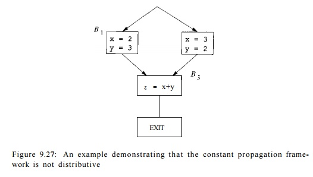
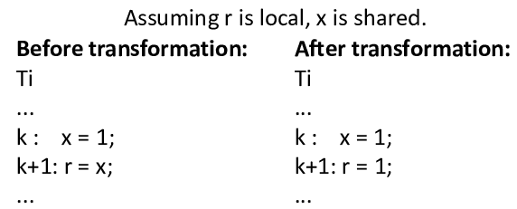
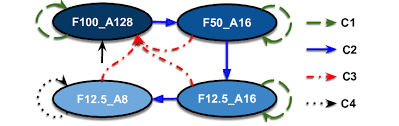

<div align="center">


# 🌟 Welcome to **Day 3** of our Digital Design Journey 🚀  

</div>


Hello Everyone 👋,  
Welcome back to **Day 3** of VLSI & Verilog exploration! 💻⚡  
Today’s session will be filled with **optimization techniques, sequential logic insights, and hands-on Verilog coding** 🎯.  

 ---

## 🎉 What’s Inside Today?  

✨ **Highlights of Day 3**:  
 - 🔍 Deep Dive into **Constant Propagation** in Sequential Logic  
 - 🛠️ Understanding **Unused Outputs & Their Impact**  
 - 🧩 Netlist-Level Optimizations and Synthesis Flow  
 - 💡 Hands-on **Verilog Code Examples** with Explanations  
 - 📊 Beautiful **Summary Tables** to connect theory ↔️ practice  

---

## 📚 Topics We’ll Explore  

| Section | Topics | Link |
|---------|--------|------|
| 1️⃣ Constant Propagation 🚦 | 🔹 What is Constant Propagation? <br> 🔹 How It Works <br> ⚡ Benefits in Combinational Logic <br> 🔵 Benefits in Sequential Logic <br> 📝 Examples & Diagrams | [✨ Explore](https://github.com/Gowtham007007/Week-1_RISC-V_Tapeout/tree/main/Day_3#1%EF%B8%8F%E2%83%A3-constant-propagation-) |
| 2️⃣ State Optimization 🧩 | 🔹 State Reduction Techniques <br> 🔹 State Encoding Schemes (Binary, One-Hot, Gray) <br> 🔹 Logic Minimization & Power Optimization <br> 📝 Example with 8→4 States <br> 🖼 Diagram Illustration | [🚀 Discover](https://github.com/Gowtham007007/Week-1_RISC-V_Tapeout/tree/main/Day_3#2%EF%B8%8F%E2%83%A3-state-optimization-) |
| 3️⃣ Cloning 🏗️ | 🔹 Purpose of Cloning in VLSI <br> 🔹 Steps: Identify, Duplicate, Redistribute, Place & Route <br> 📝 Example: Load Balancing in Combinational Blocks <br> ⚡ Timing Improvement | [🔍 Peek](https://github.com/Gowtham007007/Week-1_RISC-V_Tapeout/tree/main/Day_3#3%EF%B8%8F%E2%83%A3-cloning-%EF%B8%8F) |
| 4️⃣ Retiming ⏱️ | 🔹 Sequential Circuit Optimization <br> 🔹 Graph Representation of FFs & Logic <br> 🔹 Register Repositioning & Timing Analysis <br> ⚡ Example of Critical Path Shortening | [🛠️ Dive In](https://github.com/Gowtham007007/Week-1_RISC-V_Tapeout/tree/main/Day_3#4%EF%B8%8F%E2%83%A3-retiming-%EF%B8%8F) |
| 5️⃣ Labs on Optimization Techniques 🧪 | 🔹 Lab 1–4: Constant Propagation & Combinational Logic <br> 🔹 Lab 5–6: Sequential Circuits (D Flip-Flops) <br> 🔹 Netlist Generation & Waveform Analysis <br> 🖥️ Practical Verilog Examples | [💻 Inspect](https://github.com/Gowtham007007/Week-1_RISC-V_Tapeout/tree/main/Day_3#5%EF%B8%8F%E2%83%A3-labs-on-optimization-techniques-) |
| 6️⃣ Handling Unused Outputs 🗑️ | 🔹 Concept & Importance <br> 🔹 Verilog Code Examples with Unused Outputs <br> 🔹 Netlist Behavior & Optimization <br> ⚡ Summary Table: Source Code vs Netlist | [✨ Learn More](https://github.com/Gowtham007007/Week-1_RISC-V_Tapeout/tree/main/Day_3#6%EF%B8%8F%E2%83%A3-handling-unused-outputs-%EF%B8%8F) |
| 7️⃣ Summary & Key Learnings 📊 | 🔹 Recap of Constant Propagation, State Optimization, Cloning, Retiming, Labs, and Unused Outputs <br> 🔹 Practical Takeaways & Insights | [📘 Recap](https://github.com/Gowtham007007/Week-1_RISC-V_Tapeout/tree/main/Day_3#7%EF%B8%8F%E2%83%A3-summary--key-learnings-) |
 

 ---

 ✨ Get ready, this **Day 3** will not only teach you theory but also show you how it looks in practice with Verilog codes and synthesis results! 🚀  

 💪 Let’s begin our journey 👉 **towards smarter digital design!**  


# 1️⃣ Constant Propagation 🚦

 Constant propagation is an important **optimization technique** in VLSI design and digital synthesis.
 It replaces variables or signals that hold **constant values** with their literal constants during logic synthesis. 
 By doing this, the design tools can simplify the logic, reduce hardware complexity, and improve performance. 

--- 
## 🔎 How It Works 
1. The synthesis tool **analyzes the HDL code** (Verilog/VHDL/SystemVerilog).
2. If a signal or variable is **statically assigned a constant**, the tool propagates this constant throughout the circuit.
3. Any gates, flip-flops, or expressions that depend only on this constant are simplified or even **eliminated**.
4. This process reduces unnecessary computations and makes the final synthesized circuit more efficient.
--- 
## ⚡ Benefits of Constant Propagation 

**Reduced Complexity**: Unnecessary gates are removed, making the circuit smaller. 
- **Performance Improvement**: Critical paths can become shorter, reducing delays.
- **Resource Optimization**: Fewer logic resources (gates, LUTs, or flip-flops) are consumed.
- **Lower Power**: Less switching activity means reduced dynamic power consumption.
---


## 🟢 Constant Propagation in Combinational Logic In purely **combinational circuits**, constant propagation often leads to **gate elimination**.

### Example:
```verilog
assign y = a & 1'b0;  // ANDing with 0
```
Another case:
```verilog
assign z = b | 1'b1;  // ORing with 1
```

z will always be 1. The OR gate is removed, and z is tied to constant logic 1. Result: Entire gates or paths are deleted, saving area and improving timing. 


# Example of demonstrating Constant Propogation : 



## 🔵 Constant Propagation in Sequential Logic

In sequential circuits, constant propagation can simplify state machines or flip-flop behavior when certain inputs or control signals are fixed.

Example:

```verilog
always @(posedge clk) begin
    if (1'b0)          // constant false condition
        q <= d;
    else
        q <= q;
end
```
* Since the condition is always false, the first branch never executes.
* The synthesis tool recognizes this and optimizes q to simply hold its value, possibly removing redundant hardware.
  
Disabled Counter :

```verilog
  reg enable = 1'b0;
  always @(posedge clk) begin
    if (enable)
        count <= count + 1;
  end
```
* Since enable is a constant 0, the counter never increments.
* The entire counter logic can be eliminated.


Constant Input to State Machine :

```verilog
always @(posedge clk) begin
    case(state)
        IDLE: if (start == 1'b0) next_state <= IDLE;
        ...
    endcase
end
```


* If start is always 0, the transition to other states can never happen.
* The synthesis tool optimizes the state machine by removing unreachable states, reducing area and power.

  
  # Benefits in Sequential Logic
  1.Reduces area: Unused flip-flops and registers are removed.
  2.Reduces power consumption: Fewer gates switching.
  3.Improves timing: Shorter critical paths by removing unnecessary logic.
  4.Simplifies verification: Less logic to simulate and verify.
  5.Result: Reduces unnecessary flip-flops and sequential logic, lowering area and power.

  

Constant propagation in sequential logic focuses on simplifying conditional operations, counters, and state machines when signals are constant. This leads to more efficient, smaller, and faster circuits. 


# 2️⃣ State Optimization 🧩 

State optimization is an important technique in **finite state machine (FSM) design** for VLSI circuits. The goal is to make the FSM **smaller, faster, and more power-efficient** by reducing unnecessary states, optimizing state representation, and minimizing logic. --- 

## 🔎 How State Optimization Works 
   1. **State Reduction** - Merge **equivalent states** that produce the same outputs for all inputs. - Reduces the total number of states in the FSM, saving flip-flops and combinational logic.
   2. **State Encoding** - Assign **optimal binary codes** to each state to minimize combinational logic complexity. - Common encoding schemes: - Binary Encoding - One-Hot Encoding - Gray Encoding
   3. **Logic Minimization** - Apply **Boolean algebra simplifications** or use synthesis tools to generate **compact logic equations** for next-state and output logic. - Reduces the number of gates required.
   4. **Power Optimization** - Techniques such as **clock gating** or **signal gating** reduce unnecessary switching activity. - Helps lower **dynamic power consumption** in the FSM.
      
       ---
      
 ### Example Suppose an FSM has 8 states, but only 4 are functionally distinct. After **state reduction**:
```text
Original States: S0, S1, S2, S3, S4, S5, S6, S7
Reduced States: S0, S1, S2, S3
```
# Illustartion



# 3️⃣ Cloning 🏗️ 

 Cloning is a **circuit optimization technique** in VLSI design where a logic cell or module is **duplicated** to improve performance, reduce power, or optimize timing. It is commonly used to **balance load**, **reduce     wire length**, and **improve signal propagation** along critical paths. --- 
 ## 🔎 How Cloning Works 
 1. **Identify Critical Paths** - Use **timing analysis tools** to find slow or heavily loaded paths in the design. -     Critical paths are the targets for optimization. 
 2. **Duplicate the Target Cell/Module** - Create an **identical copy** of the logic cell or module that contributes to the critical path delay.
 3. **Redistribute    Connections** - Split the fan-out of the original cell between the original and the cloned cell. - This balances the load on each output, reducing delay.
 4. **Place and Route the Cloned Cell** - Position the cloned cell in a location that **minimizes wire length** and ensures good timing.
5. **Verify Improvements** - Re-run **timing and power analysis** to ensure the cloning achieves the desired optimization. - Adjust placement or connections if necessary.
   
   ---

 
 ## 🟢 Cloning Example Suppose a combinational block AND1 drives 6 heavy load gates, causing a timing bottleneck:
 
```text
Original:
AND1 ---> GateA, GateB, GateC, GateD, GateE, GateF
After cloning:
```
```text
Cloned:
AND1 ---> GateA, GateB, GateC
AND1_clone ---> GateD, GateE, GateF
```
# 4️⃣ Retiming ⏱️


  Retiming is a **circuit optimization technique** used in VLSI design to improve **performance, timing, and sometimes power efficiency** by repositioning **registers (flip-flops)** in a sequential circuit without altering its functionality.


## 🔎 How Retiming Works 
1. **Graph Representation** - Model the sequential circuit as a **directed graph** where nodes represent combinational logic and edges represent registers (flip-flops).
2. **Register Repositioning** - Move registers across combinational logic blocks to **balance path delays**. - The goal is to **shorten the longest path** (critical path) and allow faster clock operation.
3. **Constraints Analysis** - Ensure that repositioning maintains **functional correctness** of the circuit. - Consider **setup, hold, and timing constraints** to prevent timing violations.
4. **Optimization** - Adjust register positions to **minimize the clock period** or **optimize power**. - Retiming can reduce critical path delay, allowing higher operating frequencies.
    ---
   
## 🟢 Example Suppose a sequential circuit has a long critical path between two flip-flops:

```text
FF1 ---> Logic Block A ---> Logic Block B ---> FF2
```
After retiming:


```text
FF1 ---> Logic Block A ---> FF1_new ---> Logic Block B ---> FF2
```


# 5️⃣ Labs on Optimization Techniques 🧪 


### Lab 1

Below is the Verilog code for Lab 1:

```verilog
module opt_check (input a , input b , output y);
	assign y = a?b:0;
endmodule
```

**Explanation:** 

assign y = a ? b : 0; means: 
- If a is true, y is assigned the value of b.
- If a is false, y is 0.
Follow the steps from [Day 1 Synthesis Lab](https://github.com/Gowtham007007/Week-1_RISC-V_Tapeout/edit/main/Day_1/#6-synthesis-lab-with-yosys) and add the following between abc -liberty and synth -top:
shell
```
opt_clean -purge
```

 
---

### Lab 2 Verilog code:


```verilog
module opt_check2 (input a , input b , output y);
	assign y = a?1:b;
endmodule
```
**Code Analysis:**
- Acts as a multiplexer:
- y = 1 if a is true.
- y = b if a is false.

  
 

---
### Lab 3 Verilog code:

```verilog
module opt_check2 (input a , input b , output y);
	assign y = a?1:b;
endmodule
```
**Functionality:** 
2-to-1 multiplexer;
y = a ? 1 : b (outputs 1 when a is true, otherwise b). 

 

--- 

### Lab 4 Verilog code:

```verilog
module opt_check4 (input a , input b , input c , output y);
 assign y = a?(b?(a & c ):c):(!c);
 endmodule
```

**Functionality:** 
- Three inputs (a, b, c), output y.
- Nested ternary logic:
- If a = 1, y = c.
- If a = 0, y = !c.
- Logic simplifies to:
- y = a ? c : !c

 
 
 ---
 
 # Verilog Source Code vs Synthesized Netlist
 
 In VLSI design, understanding the difference between **Verilog source code** and the **synthesized netlist** is crucial. 
 - **Verilog Source Code**: High-level, human-readable description of the design using modules, wires, and assignment statements.
 - **Synthesized Netlist**:
 The detailed, gate-level representation generated after synthesis, ready for layout and backend verification.
 ---
 
## 🔹 Source Code (Verilog) 
- Describes the design **at a high level**.
- Uses modules, wires, and assignment statements to define the desired behavior and structure.
- Includes abstract operations like assign, module instantiation, logical operators (AND, OR, multiplication, etc.).
- **Technology-independent**: Does not specify actual gates or cells used in hardware.
- Intended for **simulation and functional verification**.

  
 ---
 
* Multiple Module Opt_check
    
```verilog
module sub_module1(input a, input b, output y);
  assign y = a & b;
endmodule

module sub_module2(input a, input b, output y);
  assign y = a*b;
endmodule

module multiple_module_opt(input a, input b, input c, input d, output y);
  wire n1, n2, n3;

  sub_module1 U1 (.a(a), .b(1'b1), .y(n1));
  sub_module2 U2 (.a(n1), .b(1'b0), .y(n2));
  sub_module2 U3 (.a(b), .b(d), .y(n3));

  assign y = c | (b & n1);

endmodule
```

* Multiple Module Opt_check2

  
```verilog
  module sub_module(input a, input b, output y);
  assign y = a & b;
  endmodule

  module multiple_module_opt2(input a, input b, input c, input d, output y);
  wire n1, n2, n3;

  sub_module U1 (.a(a), .b(1'b0), .y(n1));
  sub_module U2 (.a(b), .b(c), .y(n2));
  sub_module U3 (.a(n2), .b(d), .y(n3));
  sub_module U4 (.a(n3), .b(n1), .y(y));

  endmodule

```


## 🔹 Netlist (Synthesized Output) 
- Generated after synthesis to map the design to **specific logic gates or standard cells** in the target technology.
- Breaks down modules into interconnected gates/cells such as AND, OR, NOT, and other complex library elements.
- All wiring and connectivity are explicitly defined.
- Netlist diagrams show **signal paths, pins, blocks, and interconnections**, making the hardware implementation ready for **layout, timing, and physical verification**.

  
* Multiple Module Opt_check

  

* Multiple Module Opt_check2 


---

## 🔹 Key Differences

| Aspect       | Verilog Source Code                       | Synthesized Netlist                                  |
|-------------|------------------------------------------|-----------------------------------------------------|
| Level       | Abstract, functional                      | Detailed, gate/cell-level                           |
| Technology  | Independent                               | Mapped to standard cell library                     |
| Readability | Human-readable, modular                   | Optimized, machine-readable, less abstract         |
| Purpose     | Design entry, simulation                  | Implementation, backend verification, layout       |
| Components  | Modules, assign statements, wires        | Blocks, gates, nets, pins per technology           |

---

### Lab 5

# Sequential Circuits and its Optimization Verilog code:
```verilog
module dff_const1(input clk, input reset, output reg q);
always @(posedge clk, posedge reset)
begin
	if(reset)
		q <= 1'b0;
	else
		q <= 1'b1;
end
endmodule
```

**Functionality:** 
- D flip-flop with:
- Asynchronous reset to 0
- Loads constant 1 when not in reset


**Waveform :** 

.

**Netlist :** 


--- 

### Lab 6 Verilog code:


```verilog
module dff_const2(input clk, input reset, output reg q);
always @(posedge clk, posedge reset)
begin
	if(reset)
		q <= 1'b1;
	else
		q <= 1'b1;
end
endmodule
```


**Functionality:** 
- D flip-flop always sets output q to 1 (regardless of reset or clock).

 
**Waveform :** 

 

**Netlist :**  

--- 

# Similar Examples of Sequential Circuits Optimization with Verilog code and Netlist : 

**Verilog Codes of Three different modules :** 

 

# Individual Waveforms : 

Const 3 : 

 

Const 4 : 

 

const 5 : 

 

--- 

# Individual Netlist : 

Const 3 : 

 

Const 4 : 

 

const 5 : 

 

--- 

# 6️⃣ Handling Unused Outputs 🗑️ 

In digital circuit design, sometimes certain outputs of a module or combinational block are **not used** in the higher-level design. Optimizing these unused outputs can **reduce circuit area, power, and complexity**.

---

## 🔹 Concept 
- When an output is **not connected** or **unused**, synthesis tools can often **ignore or remove** the logic driving that output.
- This leads to a **simplified netlist**, as gates or combinational paths that only contribute to unused outputs are **eliminated**.
- Retaining unused logic unnecessarily increases **area, power, and timing complexity**.

 --- 
 
When designing digital circuits in Verilog, unused outputs (or signals that are not connected, read, or used at higher levels) are typically neglected during synthesis—so the netlist omits related gates and connections to optimize the hardware. 

## Verilog Code Example with Unused Outputs

```verilog
module sample_unused_output(
    input  wire a,
    input  wire b,
    output wire used_out,
    output wire unused_out  // This will be left unconnected at top level
);

assign used_out   = a & b;
assign unused_out = a | b;  // Not used in higher-level module

endmodule

module top_module(
    input wire a,
    input wire b,
    output wire y
);

wire used_signal;
wire unused_signal;

sample_unused_output U1 (
    .a(a),
    .b(b),
    .used_out(used_signal),
    .unused_out() // not connected or simply omitted
);

assign y = used_signal;

endmodule
```


 In the top module, unused_out from the submodule is **not connected** to anything and not used in further logic. The synthesis tool **removes any hardware** solely responsible for driving unused_out, unless forcedotherwise (some tools can drive it to zero). 
 
--- 
## 🔹 Netlist Behavior with Unused Outputs 
 - During **netlist generation**, logic driving unused outputs is detected and typically **eliminated**, reducing gate count and optimizing area and power.
 - Only connections that influence **used outputs** (used_out) are maintained.
 - Logic for unused_out is **omitted** unless specifically constrained or forced to remain.
 - Warnings may be issued about unused outputs, but **physical resources are saved**.


# Example of Demonstrating Unused Outputs

# Verilog Code : 

 

Code 2 : 

  

# Waveform : 

 

# Netlist : 

 

---

## Summary Table

| Aspect                | Verilog Source Code                | Netlist Result                               |
|----------------------|-----------------------------------|---------------------------------------------|
| Unused Output Signal  | Declared and assigned             | Not present (logic eliminated)              |
| Synthesis Warnings    | May warn about unused outputs     | Output port may be driven to zero or omitted|
| Optimization Result   | Logic for unused outputs exists   | Logic removed; area and power saved        |

---

# 7️⃣ Summary & Key Learnings 📊

- **Focus:** Optimization techniques for combinational and sequential circuits in digital design, with practical Verilog labs.  
- **Topics Covered:**  
  1. **Constant Propagation:** Replacing variables with constant values to simplify logic and improve circuit efficiency.  
  2. **State Optimization:** Reducing states and optimizing encoding in finite state machines to use less logic and power.  
  3. **Cloning:** Duplicating logic cells/modules to improve timing and balance load.  
  4. **Retiming:** Repositioning registers in a circuit to enhance performance without altering its function.  
- **Labs:** Six practical Verilog labs illustrate these concepts, including examples of combinational logic optimizations and D flip-flop behaviors, each with code snippets and output images.

